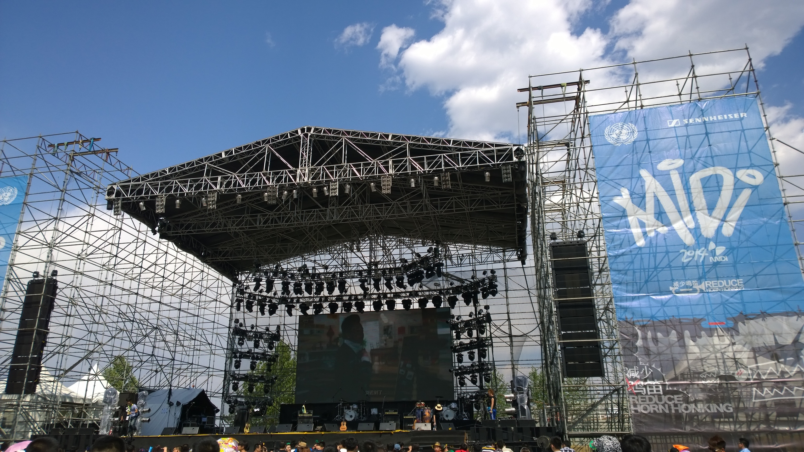
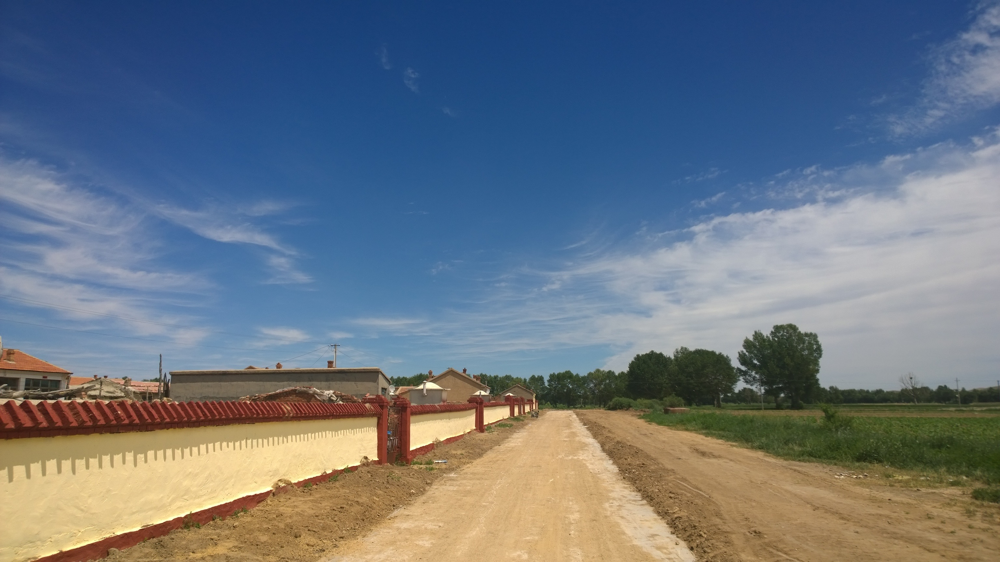
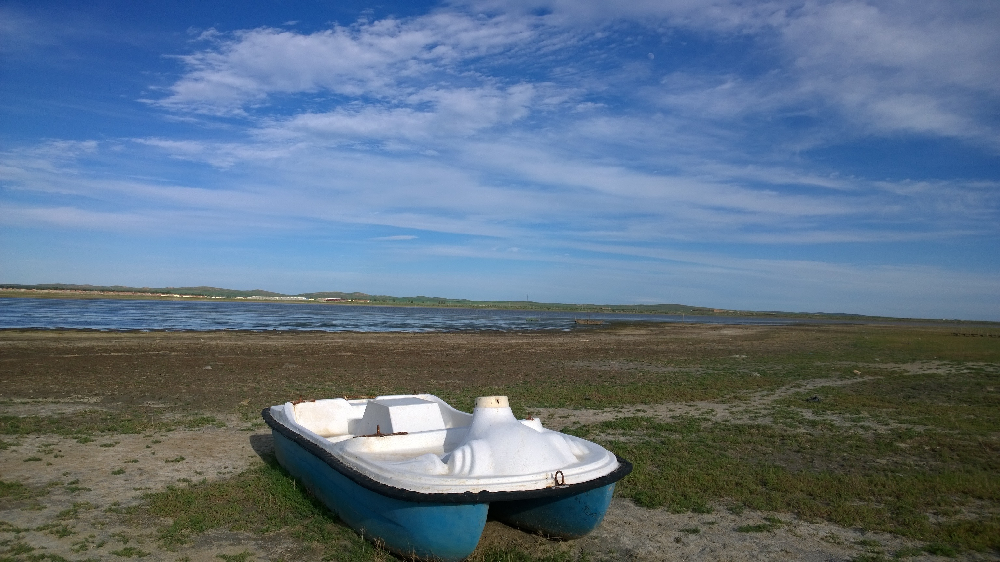
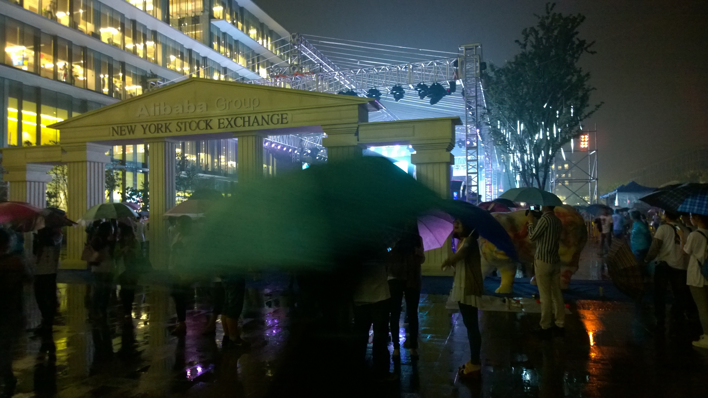

## 回顾2015

>本想着也回顾下过去的2015，发现自己从2014年7月加入阿里以来，已有一年半的时间了，还一直没有过自己的回顾与思考，所以就着回顾过去的2015，本着买二送一的原则，我也把2014年的后半年回顾下吧。

### 2014年5月前夕

再有几天就是五一了，一个小长假，每年这个小长假，中国的摇滚音乐节品牌迷笛都要在北京和上海举办一年一度的狂欢---迷笛音乐节，不知什么时候开始，不再爱听情情爱爱的流行音乐，转而喜欢上了摇滚乐，按说我已过了叛逆的年岁，事实上是因为热爱，听了很多乐队，也喜欢上了很多乐队，五一前的这一天，我终于下定决心，前往北京，去往迷笛现场，亲眼看看亲耳听听我喜欢的那些乐队。

三天的狂欢，带着帐篷，睡在迷笛营，听着现场，跟着乐队一起嘶吼，一起POGO，一起随着音乐节奏律动，放肆的放肆，那一刻我知道，做了近两年的创业梦，该醒了，回去就辞职吧！

### 2014年6月

写好了简历，没想到刚把简历放到拉勾网的第二天，阿里就给打来了面试电话，电面顺利通过，于是就在5月底，向带了我两年多的老大提出辞职，整个六月都在面试，一面过了，接着二面，二面过了，接着三面，三面通过后，说大老板胡晓东还要面一下，于是就是漫长的等待，等了两周，最后终于以大老板没有时间结束这场面试马拉松，顺利通过全部面试，拿到offer，约定好7月14日入职。

### 2014年7月

顺利办理完离职手续后，终于回到了老家内蒙，已有四五年的夏天没有回到过内蒙了，大学时忙于学业，与几个兄弟一起创立Usoft实验室，做项目，招新人，做培训，忙的不亦乐乎，毕业后，投身所谓的创业，更是献出了两年的双休日，想想这两年过的着实太累了，不过所幸还有自己技术精进的收获，现在终于回到故乡，回到故乡的人都是脆弱的，看着故乡的天、故乡的云、故乡的土地、故乡的人，故乡总有种看不倦的美。

### 入职阿里

2014年7月14日，正式入职阿里，刚刚入职阿里的时候，感觉西溪园区简直就是一个迷宫，开会总是找不到会议室，会议室的命名也是各种武侠，大家以师兄师姐相称，感觉还生活在大学中

入职阿里两个月后，赶上了阿里在纽交所上市，见证了这一历史时刻

### 在淘宝阅读

在淘宝阅读这小半年，负责了淘宝阅读移动Web阅读器的维护开发工作，来到阿里让我接受了一个我很不愿意接受的新概念---H5，H5即HTML5，HTML5我早有了解，但是在阿里H5专指无线Web应用，刚来时真的是很不能接受PD、运营、设计以及部分服务端这么个叫法，最后还是只好无奈接受。

在淘宝阅读的这段时间，技术上主要有以下几个关注点

- 前端工程化，2014年真是前端工程化年，无论是技术圈子里，还是在公司，前端都开始更加强调工程化，在淘宝阅读，做的几件事情，感觉最值得的就是把之前的代码重构并工程化

- Node工具，提升团队效率的工具，大家都开始关注，有了Node，前端开发些实用的工具真是得心应手

- 前后端分离，阿里的大多系统都是Java的，很多现有的网站也都是Java的MVC架构，前端要负责View层，与服务端协作联调起来非常麻烦，于是在有了node之后，阿里开始有了自己的Node框架，可以代理Java的业务接口，前端开始负责view层和controller层，以达到前后端分离的效果

差不多在淘宝阅读的小半年时间里，技术上基本都关注在这几个点上

### 转岗

2015年1月1日，2014年就这样过去了，随着2014年的过去，在淘宝阅读的日子也随之而去，转岗到淘点点，转岗，这是我最喜欢阿里的一个地方，阿里在公司内部是可以转岗的，简单的说，阿里有很多的BU，每个BU又相对独立，转岗的条件是需要在当前的岗位上干满一年，而我还没有干满一年，属于被动转岗，没办法，变化太快，于是在和淘点点的前端技术聊过之后，非常喜欢他们当时实践的技术方案，决心加入，不为别的，只为技术。

### 在淘点点的日子

实际上，我只在淘点点待了不到五个月。

在淘点点的这段时间里，基本是在实践以下几个技术点

- Angular
  - Angular在我来到阿里之前就曾有使用，用来做过单页的后端管理系统，也做过移动应用，当时用的ionic，Angular还是比较熟悉的  

- Node
  - 这次终于用上了Node，使用的阿里内部的Node框架，代理业务接口

- 用Node渲染Angular模板
  -  这是这个应用最吸引我的一个设计，我们都知道，Angular的ng-repeat用来在前端通过template渲染数据，性能奇差，但是我们这一次使用了Node帮助Angular渲染模板，Node直接向Angular输出渲染好的静态模板，这样就加速了页面的显示速度，找时间我觉得可以把这个架构分享下

### 在支付宝的日子

2015年，五一之后，来到支付宝上班，终于来到这个传说中牛逼的公司，牛逼的团队工作，我不知道是该高兴还是该悲伤，因为我又被变化了。不过现在已经过去了，我可以给个结论了，真的是该高兴，高兴于有幸见识到这个牛逼的团队，高兴于在这大半年的时间里，技术上有了大突破。

谈谈支付宝这个团队，来到这里，我才真正感受到了阿里的那股劲儿，那股冲劲儿，那股敢为天下先的勇气，那股不分你我，只为产品的担当，支付宝的每个人都很拼，这种团队的气质是着实吸引我的。

团队的每个人，每天都是随时待命的，出现问题第一时间解决，这样的执行力才能铸就优秀的产品

在支付宝还经历了2015年的双十二线下狂欢，有幸参与了这一次历史时刻，马总还来看望了我们，抢各位大老板们的红包更是抢到手软，当一个团队去执行这样一个大型活动的时候，更能体现出一个团队的整体气质

在支付宝的这大半年时间里，技术上，主要也是专注在以下几个点

- React
  - 一直关注，自己开发着玩，不过最终在双十二中得以实践，爽了一把。
- ES6
  - 在用Node开发项目中，实践ES6，非常爽
- Node
  - 还是Node，这一年终于有机会，用Node完全Owner一个项目
- 组件库
  - 这大半年，还为全栈工程师，打造出了一个组件库，仍在优化加实践

这大半年收获颇丰，也是相当的忙碌，基本上同时要做两个项目

### 今年的几件人生大事

- 订婚了，2016年，我们就要结婚了。

- 第一次去了草莓音乐节

- 见了很多老朋友

- 去了很多地方，虽然都不远，哈哈哈

## 2016

又是新的一年的元旦

2016年元旦到来之际，我正式加入了口碑，希望这一次的选择是对的，打下线下这场仗

希望自己在2016年，坚持锻炼、坚持学习、坚持写博客。

希望2016能在杭州安个家

